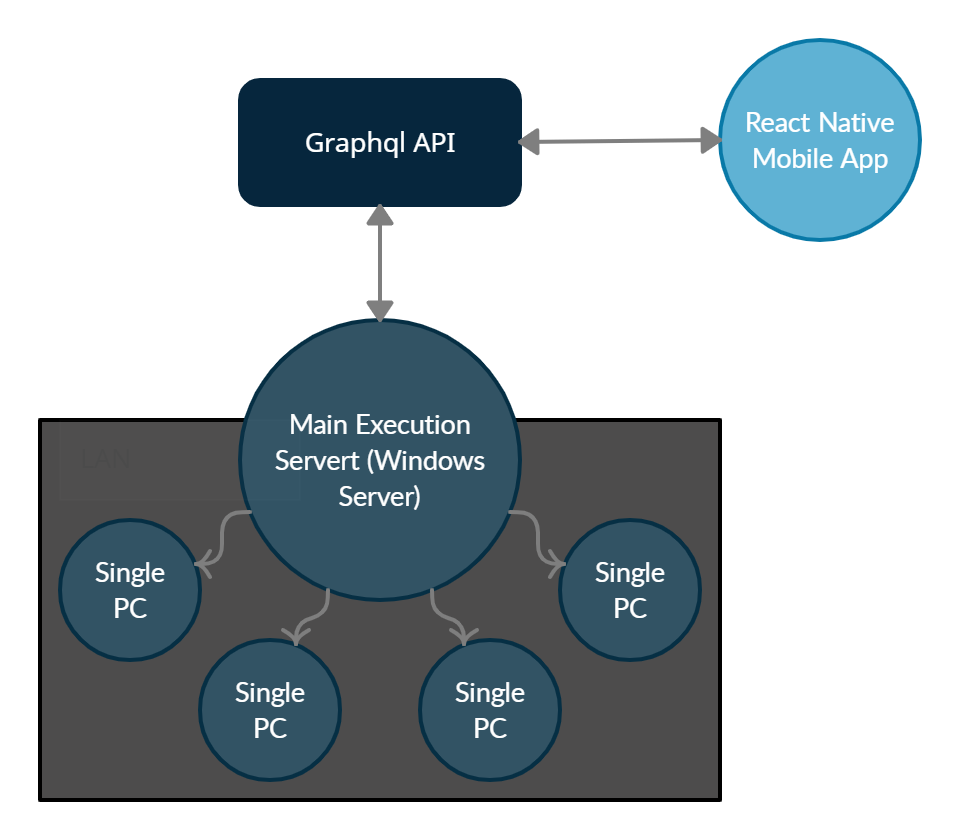

# WrongDoor

### Modules:

#### Server Side:

- [GraphQL API] - Node.js GraphQL-API for creating brige between phone and [Main Execution Server].

- [GraphQL Connecter] - GraphQL API Client for C#
- [Main Execution Server] - Server for executing global commands

#### Client Side:

- [React Native Mobile App] - App connected to [GraphQL API] with registration ability

[graphql api]: https://github.com/wdoor/wrong-door-api
[react native mobile app]: https://github.com/wdoor/wrong-door-mobile-react
[graphql connecter]: https://github.com/wdoor/SmartCollege/tree/master/WrongDoor.Connector
[main execution server]: https://github.com/wdoor/SmartCollege/tree/master/WrongDoor.MainServer
